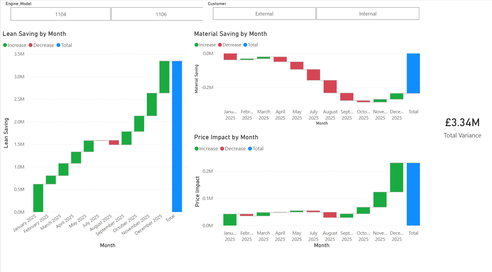

# 🏭 Peterborough Plant - FY25 Profit Variance Analysis

This project provides a comprehensive financial attribution model for the **Perkins 1100 Series Engines** (Caterpillar) at the Peterborough facility.

## 🎯 Business Context
In FY2025, the plant faced significant raw material inflation. This model was built to quantify the impact of **Lean Manufacturing efficiency** in offsetting rising supply chain costs.

## 📊 Key Highlights
- **Star Schema Modeling**: Integrated Actuals vs. Budget data with a 1:N relationship.
- **DAX Measures**: Developed custom logic for Price Impact, Material Savings, and Lean Achievement.
- **Strategic Insight**: Confirmed that **£3.5M in Lean Savings** successfully protected the plant's margin despite a £0.2M material cost headwind.

## 📁 Project Structure
- `Analysis_Model.pbix`: The full Power BI interactive dashboard.
- `Report_Summary.pdf`: Executive summary for management review.

## 🖼️ Dashboard Preview

